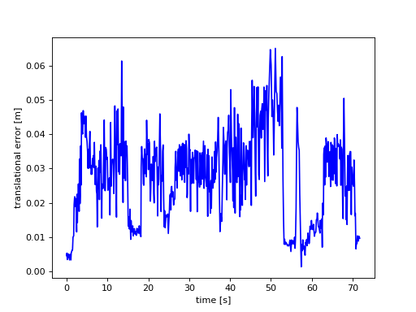
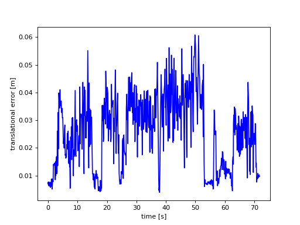
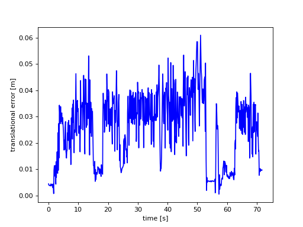
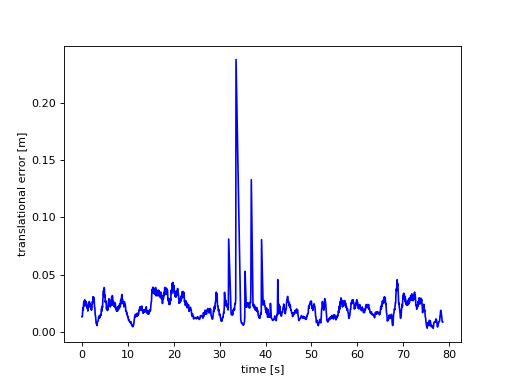

# vo_lstm

## Installation

```shell
$ pip3 install -r requirements.txt
```

## Dataset

The dataset employed in this Visual odometry demo is the [TUM dataset](https://cvg.cit.tum.de/data/datasets/rgbd-dataset/download). Specifically, the following sequences are used to train the model:

- [freiburg2_pioneer_360](https://cvg.cit.tum.de/rgbd/dataset/freiburg2/rgbd_dataset_freiburg2_pioneer_360.tgz)
- [freiburg2_pioneer_slam](https://cvg.cit.tum.de/rgbd/dataset/freiburg2/rgbd_dataset_freiburg2_pioneer_slam.tgz)
- [freiburg2_pioneer_slam2](https://cvg.cit.tum.de/rgbd/dataset/freiburg2/rgbd_dataset_freiburg2_pioneer_slam2.tgz)
- [freiburg2_pioneer_slam3](https://cvg.cit.tum.de/rgbd/dataset/freiburg2/rgbd_dataset_freiburg2_pioneer_slam3.tgz)

You have to download and extract the each sequence into the dataset/train directory.

## Train

First, configure the params to train the model. Check them in the [params.py](params.py) file. Then, run the training script.

```shell
$ python3 train.py
```

## Validation

The [TUM online validation tool](https://cvg.cit.tum.de/data/datasets/rgbd-dataset/online_evaluation) is used to validate the model. For this aim, the following sequences can be used. Download and extract this sequence into the dataset/val directory.

- [freiburg2_pioneer_360_validation](https://cvg.cit.tum.de/rgbd/dataset/freiburg2/rgbd_dataset_freiburg2_pioneer_360_validation.tgz)
- [freiburg1_room_validation](https://cvg.cit.tum.de/rgbd/dataset/freiburg1/rgbd_dataset_freiburg1_room_validation.tgz)
- [freiburg3_walking_rpy_validation](https://cvg.cit.tum.de/rgbd/dataset/freiburg3/rgbd_dataset_freiburg3_walking_rpy_validation.tgz)

Before using the validation tool, generate the position and orientations for the validation sequence. Then, upload the generated file and configure the validation tool setting the sequence length that is the frames per pose.

```shell
$ python3 val.py
```


## Results

Put your results here showing the graphs got from [TUM online validation tool](https://cvg.cit.tum.de/data/datasets/rgbd-dataset/online_evaluation).


### Resultado 1. Resnet50 + no bidireccional

Los parámetros son los siguientes:

```python
# LSTM
hidden_size = 256 # tamaño de salida de la LSTM
num_layers = 2 # numero de celdas
bidirectional = False # True o False
lstm_dropout = 0.25 # float

# dataset
sequence_length = 2 # de una imagen a otra
batch_size = 8

# train
learning_rate = 0.001
epochs = 3
```

Resultados en la herramienta online (freiburg2_pioneer_360):

```
compared_pose_pairs 610 pairs
translational_error.rmse 0.029697 m
translational_error.mean 0.026942 m
translational_error.median 0.027219 m
translational_error.std 0.012491 m
translational_error.min 0.001308 m
translational_error.max 0.065099 m
rotational_error.rmse 1.958319 deg
rotational_error.mean 1.657506 deg
rotational_error.median 0.028195 deg
rotational_error.std 1.042922 deg
rotational_error.min 0.016804 deg
rotational_error.max 4.464192 deg
```

Plot del error:




### Resultado 2. Resnet50 + bidireccional

Los parámetros son los siguientes:

```python
# LSTM
hidden_size = 256 # tamaño de salida de la LSTM
num_layers = 2 # numero de celdas
bidirectional = True # True o False
lstm_dropout = 0.25 # float

# dataset
sequence_length = 2 # de una imagen a otra
batch_size = 8

# train
learning_rate = 0.001
epochs = 3
```

Resultados en la herramienta online (freiburg2_pioneer_360):

```
compared_pose_pairs 610 pairs
translational_error.rmse 0.028129 m
translational_error.mean 0.025136 m
translational_error.median 0.026016 m
translational_error.std 0.012625 m
translational_error.min 0.003955 m
translational_error.max 0.060824 m
rotational_error.rmse 2.046308 deg
rotational_error.mean 1.733868 deg
rotational_error.median 0.029502 deg
rotational_error.std 1.086775 deg
rotational_error.min 0.043117 deg
rotational_error.max 8.813132 deg
```

Plot del error:




### Resultado 3. Resnet18 + bidireccional

Los parámetros son los siguientes:

```python
# LSTM
hidden_size = 256 # tamaño de salida de la LSTM
num_layers = 2 # numero de celdas
bidirectional = True # True o False
lstm_dropout = 0.25 # float

# dataset
sequence_length = 2 # de una imagen a otra
batch_size = 8

# train
learning_rate = 0.001
epochs = 3
```

Resultados en la herramienta online (freiburg2_pioneer_360):

```
compared_pose_pairs 610 pairs
translational_error.rmse 0.027938 m
translational_error.mean 0.024873 m
translational_error.median 0.026689 m
translational_error.std 0.012723 m
translational_error.min 0.000591 m
translational_error.max 0.060959 m
rotational_error.rmse 1.936806 deg
rotational_error.mean 1.635976 deg
rotational_error.median 0.027950 deg
rotational_error.std 1.036725 deg
rotational_error.min 0.018328 deg
rotational_error.max 4.513865 deg
```

Plot del error:



### Resultado 3. Evaluación con room


```python
# LSTM
hidden_size = 256 # tamaño de salida de la LSTM
num_layers = 2 # numero de celdas
bidirectional = True # True o False
lstm_dropout = 0.25 # float

# dataset
sequence_length = 2 # de una imagen a otra
batch_size = 8

# train
learning_rate = 0.001
epochs = 3
```

Resultados en la herramienta online (freiburg1_room):

```
compared_pose_pairs 1142 pairs
translational_error.rmse 0.023442 m
translational_error.mean 0.020652 m
translational_error.median 0.019946 m
translational_error.std 0.011093 m
translational_error.min 0.003266 m
translational_error.max 0.237688 m
rotational_error.rmse 2.384027 deg
rotational_error.mean 1.930166 deg
rotational_error.median 0.030337 deg
rotational_error.std 1.399301 deg
rotational_error.min 0.075468 deg
rotational_error.max 24.339598 deg
```

